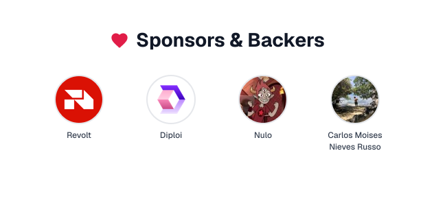

# 👋 Hi, I'm Enzo Notario

### Software Engineer | Open Source Contributor

#### 📍 Salta, Argentina 🌎

  
  
  

---

### 🌐 Quick Links

<samp>
  <a href="https://enzonotario.me">website</a> •
  <a href="https://enzonotario.me/blog">blog</a> •
  <a href="https://enzonotario.me/projects">projects</a> •
  <a href="https://github.com/enzonotario?tab=repositories">repositories</a> •
  <a href="https://github.com/sponsors/enzonotario">sponsor</a>
</samp>

---

### 💻 About Me

Software Engineer passionate about creating innovative solutions and contributing to the open source community.

---

Ingeniero de Software apasionado por crear soluciones innovadoras y contribuir a la comunidad de código abierto.

---

### ❤️ Sponsors & Backers

> [Become a sponsor](https://github.com/sponsors/enzonotario)

